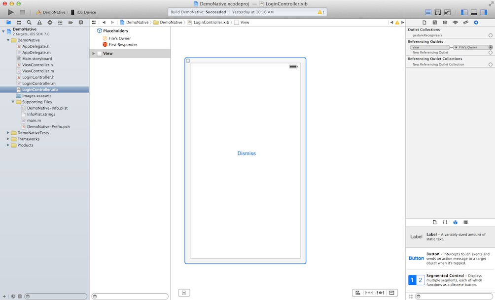
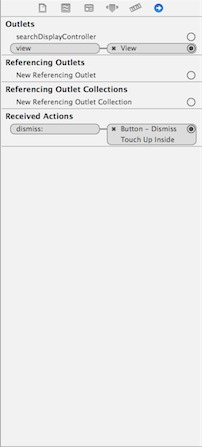

.. index:: codestart

.. _codestart:

Beginning your iOS application
=================

All application start with the AppDelegate. By looking at the AppDelegate a developer can see the methods they have to 
work with. By looking at the functions that are preprogrammed in the app one can get a better understand of the stucture
and brainstorm ideas of how to build their application fast and effective, which results in a good application by a well
rounded programmer.

AppDelegate  
--------------------------------------
First file of code to run in first program
It sets up the window view and set universal variables for application's season.

Xamarin’s Version

.. literalinclude:: ../source/ios/Demo/Demo/AppDelegate.cs
   :start-after: begin-AppDelegate-FinishedLaunching
   :end-before: end-AppDelegate-FinishedLaunching

Xcode Version

This function is called after the app has started and finished loading. In this function
the developer would declare his universal variables for the app season and place the prime view
controller in the UIWindow. 

.. literalinclude:: ../source/ios/DemoNative/DemoNative/AppDelegate.m
   :start-after: begin-AppDelegate-didFinishLaunchingWithOptions
   :end-before: end-AppDelegate-didFinishLaunchingWithOptions
   
This function is called when the app is about to resign into the background and were the developer
should save any unsaved data, like protected files, database entires, and other in app data.
   
.. literalinclude:: ../source/ios/DemoNative/DemoNative/AppDelegate.m
   :start-after: begin-AppDelegate-applicationWillResignActive
   :end-before: end-AppDelegate-applicationWillResignActive

This function runs once the app has gone into the background. aka (closes and when the user
see the list of apps)

.. literalinclude:: ../source/ios/DemoNative/DemoNative/AppDelegate.m
   :start-after: begin-AppDelegate-applicationDidEnterBackground
   :end-before: end-AppDelegate-applicationDidEnterBackground
   
When the app is opened out of the multitasking area of a iOS device the following function
would be run. A developer would put a refresher method to reload the user data in the interface
files.
   
.. literalinclude:: ../source/ios/DemoNative/DemoNative/AppDelegate.m
   :start-after: begin-AppDelegate-applicationWillEnterForeground
   :end-before: end-AppDelegate-applicationWillEnterForeground
   
If the user was to quit the app via the multitasking area, then this function would run, if 
the developer does not save any data or stored values, it would be lost forever.
  
.. literalinclude:: ../source/ios/DemoNative/DemoNative/AppDelegate.m
   :start-after: begin-AppDelegate-applicationWillTerminate
   :end-before: end-AppDelegate-applicationWillTerminate

Note: iOS Development has a hierarchy for its views
Window > ViewController > Subviews  

Also AppDelegate hold the functions that detect if the app is closing, crashing, and or have 
memory issues. (Allows developer to hand different environments and manage data in a proper fashion)

ViewController
--------------------------------------

The view controller where the user interacts with the program. 

Header (.h)
Declare (Where you tell the app what components its has and how to connect them)

Xcode
IBOutlet (Allows for access to data in a UITextfield or UITableview)
IBAction (Allows for methods to be call with tapping of UIButton or change in the index of a UISegmentControl)

Examples: 

.. literalinclude:: ../source/ios/DemoNative/DemoNative/ViewController.h
   :start-after: begin-vc-interface
   :end-before: end-vc-interface

Xamarin Version
[Outlet] 
[Action (“name of function”)]

Examples: 

.. literalinclude:: ../source/ios/Demo/Demo/DemoViewController.designer.cs
   :start-after: begin-vc-interface
   :end-before: end-vc-interface
	
Main (Where the actual code go and runs from) (.m)

ViewController’s version of the Main function we use in our c# programs is
Xcode: - (void)viewDidLoad
Xamarin: public override void ViewDidLoad () 

In additional there are more preprogramed function that do not have to be declared in the Header file.
 

Interface 
--------------------------------------

Xcode and Xamarin Studio both use Xcode's Interface builder to make its interface files.

In the lower right corner is where all the components are. To add one just click on the component and drag it
on to the view. From there you can reposition it at any time. Where you select a components you will see a set 
of parameter on the right side pannel, this is where you can edit the behavior and looks of the components.

To link the components back to the ViewController so you can actually use them, click the File's Owner and then click
the little arrow at the top of the right side pannel.

From there you will see:

The "Outlets" are to link components.

"Referencing Outlets" are to link a component to a delegate in the ViewController.

"Received Actions" are were one connects the button to an action which is a function in the ViewController.
     	

