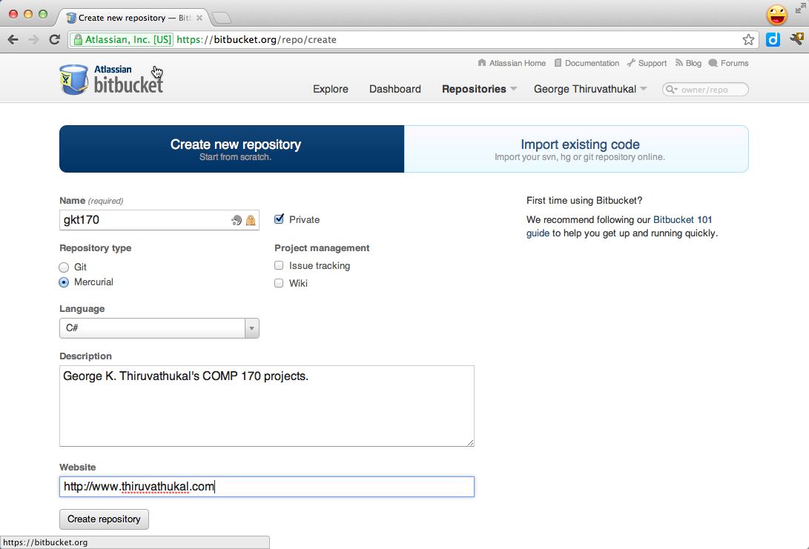

.. index::
   labs; hg and version control
   version control lab
   hg

.. 	_lab-versioncontrol:

Lab: Version Control
######################

Modern software development requires an early introduction source code
management, also known as version control. While source code
management is frequently touted as being beneficial to a *project
team*, it is also of great value for *individuals* and provides a
clear mechanism for tracking, preserving, and sharing your work.

In addition, it simplifies the process of demonstrating and submitting
your work to your instructor (and graduate assistants). Long gone are
the days of carrying stuff around on USB drives and sending e-mail
attachments.

There are numerous options for version control. In the free/open
source community, a number of solutions have emerged, including some
old (CVS, Subversion) and some new (Mercurial, Git, and Bazaar). We're
particularly fond of the Mercurial system. A key reason for our choice
is that there is an excellent cloud-based solution to host your
projects known as Bitbucket (http://bitbucket.org).

Mercurial is set up for our labs.  You can install it for your 
personal machine from http://mercurial.selenic.com/downloads/ .

There are other similar solutions to Bitbucket but none at present
provides a completely *free* solution for hosting *private*
repositories, which allow you to keep your work *secret* from others.

The basic idea is to keep a main current copy of a project at a place
like bitbucket.  Anywhere that you work, you can download a copy of the
central version.  You can add and change files.  There are several
layers insulating changes to local files from changes to the
central repository:

- You must explicitly *add* any new file names you want the repository to track.
- Even on a tracked file, you must *commit* changes to the local repository.
- For the committed changes to get to the central repository, you must *push* them.
- You have control over what files get ignored.

Later, when you want the latest changes to the central repository to get to your 
site, you need to *pull* data from the central repository, and then explicitly
*update* your local repository, to incorporate the new data from the central 
repository.

Goals
=======

In this lab, we're going to learn:

#. How to create a source code repository.

#. How to add files and folders to a repository and track them.

#. How to make sure certain files and folders are not kept in the repository.

#. How to push your changes to a remote repository (at Bitbucket.org).

#. How to do your work at home and in the lab.

#. How to get our book, examples, and projects (now that that you know how
   to use Mercurial).

Before We Proceed
-----------------

You should know that this lab is designed to be repeated as many times
as needed. You can create as many repositories as you wish, subject to
the limitations at Bitbucket.org, and may want to create different
repositories for different needs (one for yourself, one for you and
your partner in pair programming, etc.) This lab assumes you are
starting with a repository for your own work. We'll include a step for
how to add a *collaborator* to the project.

Future labs will talk about additional things you need to know when it comes
to collaboration, so please view this lab as a *beginning* aimed at helping
you to start using version control right away for your own projects.

Steps
=====

.. index:: bitbucket.org

Create Bitbucket.org account
----------------------------

We're going to begin by creating a remote repository for our work. The 
advantage of doing so is that we get a *hosted* repository that we can
use to push/pull our work. (Unlike a dangerous stunt, you *want* to be able
to try this at home, too!)

Signing up for a repository at http://bitbucket.org is easy. From the 
landing page, just click on the option for the *Free Plan*. This allows
you to create any number of public/private repositories with support
for up to 5 users. This is all you'll need for your work in this course.

Once you've created your account (and confirmed it, if required) you 
are good to go for the rest of this lab!

Create repository at Bitbucket
------------------------------

Now we'll create a first repository at Bitbucket.org.

Go to ``Repositories -> Create Repository`` (the option is at the bottom
of the list of menu options). You'll see this screen:

.. image:: images/lab-hg/hgcreaterepository.png
   :height: 300 pt
   :alt: Xamarin Studio Image
   :align: center

You'll need to fill in or select the following options:

- Name: A short name for your project. You are encouraged to keep this
  simple.  If you are using this for all of your work in COMP 170
  (which is fine) you might name the repository after your
  initials. So if your name is Linus Torvalds, you could give a short
  name like *LinusTorvaldsCOMP170* or *LTCOMP170*.

- Repository Type: Select Mercurial. Yes, we realize that Xamarin Studio
  supports Git natively, but for the reasons mentioned earlier, we
  have chosen Mercurial. We will allow you to use Git on your own if
  you can figure it out and use it properly. But this lab assumes
  Mercurial.

- Language: You can select anything you like here. We do C# for the
  most part in this class, so we recommend that you select it.

- Description: You can give any description you like. If you are
  working with a partner please list both you and your partner's name
  in the description.

- Web Site: Optional

- Private checkbox should be checked.

So just go ahead and create your first repository. You can always
create more of them later.

Here is an example of a filled out form:

Set up your Mercurial commit username
-------------------------------------

If you in a place where you have a permanent home directory,
like on your machine or in the Linux Lab,
create a file named ``.hgrc`` in *your home directory*. Your home directory is 
where you are dumped when you open a DOS or Linux/OS X terminal.  This is *not*
inside your repository.
This file must contain the following lines, with the part after the equal sign
personalized for you::

    [ui]
    username = John Doe <johndoe@johndoe.com>

It is a convention to give a name and email address, though
it does not need to match the email address you gave when
signing up for bitbucket.

Creating this file saves you the trouble of having to pass the ``-u username`` 
option to ``hg`` each time you do a *commit* operation. 

You can put this file in your home directory in Windows labs, but it disappears.
You might want to keep an extra copy in your repository, and copy it to the Windows 
home folder when in the lab.

As a gentle reminder, your home directory on Windows can be a bit difficult to find. 
The easiest way is to use your editor to locate your home folder. 
When in the DOS prompt, you will also see the path to your directory as part of the prompt. 
For example, on Windows 7, you will see ``C:\Users\johndoe``.

.. warning::
   To ensure that you did this step correctly, please open a *new* terminal or DOS 
   window at this time and use the ``ls`` or ``dir`` command to verify that the ``.hgrc``
   file is indeed present in your home directory. If it is in any other folder, Mercurial 
   (the **hg** command) will not be able to find it--and you will receive an error.

Clone a repository from Bitbucket
----------------------------------

Open a terminal or DOS command shell.  

On Windows, the Mono shell is not appropriate. You can get a regular DOS
command shell by clicking the start menu and typing ``cmd`` and into the text box
at the bottom of the start menu, and pressing return.

In the terminal/DOS-shell navigate with to the the directory 
where you want to place the repository
as a sub-directory.  This could be your home directory on your machine or
a flash drive in a lab.

**Windows only**:
To navigate in a DOS-Shell to a flash drive, you need to enter the short command::

   E:

or possible another drive letter followed by a colon.  
DOS drive letters are annoying because they be different another time with different
resources loaded.  Once you see the proper drive displayed, ``cd`` to the desired 
directory.

If all has gone well at bitbucket, you should be able to look at your
bitbucket site and see your new repository on the
list of repositories .

For example, the co-author's new repository, ``gkt170``, shows up on
the list of repositories (the dropdown) as ``gkthiruvathukal/gkt170``.

So you can now go ahead by selecting this newly created repository
from the list of repositories.  If all goes well, you should see the
following screen:

.. image:: images/lab-hg/hgrepositorysummary.png
   :height: 300 pt
   :alt: Xamarin Studio Image
   :align: center

Somewhere on this screen, you should see this text::

    Clone this repository (size: 546 bytes): HTTPS / SSH
    hg clone https://yourusername@bitbucket.org/yourusername/yourrepository

Copy the command you see in the browser starting ``hg clone``, and paste it in
as a command in your terminal/DOS-shell window. ::

    hg clone https://gkthiruvathukal@bitbucket.org/gkthiruvathukal/gkt170

You will see some output::

    http authorization required
    realm: Bitbucket.org HTTP
    user: gkthiruvathukal
    password: 
    destination directory: gkt170
    no changes found
    updating to branch default
    0 files updated, 0 files merged, 0 files removed, 0 files unresolved

You have created a copy of the (empty) bitbucket repository in a
subdirectory named the same as yourrepository (gkt170 in the example).
The is the "checkout directory", the top level of your copy.

Again, because the repository at Bitbucket is presently empty, the
above output actually makes sense. There are no files to be
updated. We'll learn more about what this output means later. It is
possible to get *unresolved* files when you make changes that
introduce conflicts. We're going to do whatever we can to avoid these
for the small projects in our course work. However, when working in
teams, it will become especially important that you and your
teammate(s) are careful to communicate changes you are making,
especially when changing the same files in a project.

.. warning::
   A version control system doesn't replace the need for human communication and being
   organized. 

Add an .hgignore and Hello World file to your project
-----------------------------------------------------

Change directory into the top-level directory of your local repository.
That should mean ``cd`` to the directory whose name matches the
bitbucket repository name.

The following is an example of a "dot hgignore" file.  Mercurial will neither
list or otherwise pay attention the files in this list:

..  code-block:: none

    # This indicates that we are using shell-like matching logic 
    #    instead of regular expressions.
    syntax: glob
    # For Mac users
    Thumbs.db
    .DS_Store
    # This is where Xamarin Studio puts compiled stuff.
    bin/
    In case you compiled your own stuff, we ignore *.exe and *.dll
    *.exe
    *.dll
    # This is a temporary debugging file generated by Xamarin Studio
    *.pidb
    # And one other thing we don't need.
    *.userprefs

Here is a brief explanation of what we've included here and why:

- ``syntax: glob`` indicates that uses the "glob" syntax, which comes
  from MS-DOS (the command prompt still found on Windows). Glob syntax
  allows you to do special things like match all files having a
  certain extension (e.g. ``*.exe`` matches ``Hello.exe`` and any
  other filename with extension .exe.)
- ``Thumbs.db`` and ``.DS_Store``. Unfortunately, the Mac is still
  notorious for generating temporary files that serve no purpose,
  except on OS X. In general, we try to keep these files out of our
  repository and encourage you to do the same, especially if you are a
  Mac user.

- ``*.exe`` and ``*.dll``. Anything that can be (re)produced by the
  Mono or Xamarin Studio tools should be excluded. In particular, do not
  keep these files in your repository. Today, they are quite small,
  but in future development work, they can be large. Worse, they are
  not text files (unlike your .cs files), so they cannot be stored
  optimally in a version control system.

- There are some other files produced by Xamarin Studio that we've put on
  the exclusion list, including ``*.pidb`` and ``*.userprefs``. The
  reasoning for not keeping these is similar to that in the previous
  case.

Now do the following steps:

#. Using your text editor, create a file ``.hgignore``. You can simply
   copy and paste the above contents into this file.  Be careful of an editor
   like notepad, which adds ".txt" to the end of file names by default.
  
  **Windows**: To change from the default extension, use Save As, and change the
   file type from .txt by electing the drop-down menu beside file type, and
   select "All files".

#. Create or copy your existing ``Hello World`` example, hello.cs to the
   the ``labs`` folder.

#. Let's test whether .hgignore is having any effect. Go to the
   ``labs`` folder and compile the ``Hello, World.`` example. 
	
#. Verify that the .cs and .exe files are in the labs directory
   (``ls`` on Linux or OS X; ``dir`` on MS-DOS)::

      gkt@gkt-mini:~/gkt170/labs$ mcs hello.cs 
      gkt@gkt-mini:~/gkt170/labs$ ls -l
      total 8
      -rw-r--r-- 1 gkt gkt  224 2012-02-20 20:02 hello.cs
      -rwxrwxr-x 1 gkt gkt 3072 2012-02-20 20:05 hello.exe
			

#. Check the status::
	
      gkt@gkt-mini:~/gkt170/labs$ hg status
      ? .hgignore
      ? labs/hello.cs
	
   What this tells us is that ``.hgignore`` and ``labs/hello.cs`` are not 
   presently being tracked by our version control system, Mercurial. The
   file ``labs/hello.exe`` is not shown, because it's on the ignore list.

   Note that we actually need to put the ``.hgignore`` file under version
   control if we want to use it wherever we happen to be working with our
   stuff (i.e. when we're not in the computer lab but, say, at home). 

#. Add the file to version control::

       gkt@gkt-mini:~/gkt170$ hg add .hgignore 
       
       gkt@gkt-mini:~/gkt170$ hg add labs/hello.cs

#. Commit the changes, and then see the log entry
   with the commands below.  If you set the .hgrc file,
   the command somewhere inside your local repository could be::
   
       hg commit -m "adding an .hgignore file and Hello, World to the project"
       
   If you did not create .hgrc, you need also include identification 
   with -u yourName after ``commit``, as in  

       hg commit -u gkt -m "adding an .hgignore file and Hello, World to the project"
   
   It is Ok if your message wraps to a new line.  You can check the log entry created
   by your commit::

       gkt@gkt-mini:~/gkt170$ hg log
       changeset:   0:9fe6ee1bf907
       tag:         tip
       user:        George K. Thiruvathukal <gkt@cs.luc.edu>
       date:        Mon Feb 20 20:14:42 2012 -0600
       summary:     adding an .hgignore file and Hello, World to the project

#. Push the changes to Bitbucket with the following command. 
   (You'll be prompted for user/password not shown here)::

       hg push 
       
   You should get a response like::
   
       pushing to https://gkthiruvathukal@bitbucket.org/gkthiruvathukal/gkt170
       searching for changes
       remote: adding changesets
       remote: adding manifests
       remote: adding file changes
       remote: added 1 changesets with 2 changes to 2 files
       remote: bb/acl: gkthiruvathukal is allowed. accepted payload.

Create an initial structure for your project
--------------------------------------------

We suggest that you follow a scheme similar to what we use when working
with version control. We suggest that your source code goes in
one or more folders, like work, or homework and labs.

So let's do it:

#. Make sure you are in the checkout directory, or ``cd`` to it.
   
#. Create directories::

       mkdir hw
       mkdir labs

   We will be creating items in each one of these folders during the lab. 
   
   .. warning::
      Please note that most version control systems do not allow you to add *empty*
      folders to the repository. You must create at least one file and **hg add** it
      to the repository (and **hg add** and **hg push**) for the folder to actually
      be created. The above was just intended to make you aware of a desired "organization".
      You are free to organize your project any way you like as long as we are able
      to find your homework assignments.

.. comment
   no idea what is in this hello project, what named, 
   already ignoring .exe 
   This all makes more sense for a definite project like the following one

    #. Create or copy the *Hello, World* C# program into the labs folder. You already
       know how to do this. If it is in another folder on your computer, you can either
       drag and drop it using your operating systems's file manager or the OS copy 
       command (Linux or OS X ``cp`` or Windows ``copy``).
    
    
    
    #. Now let's do a status check::
    
           $ hg status
           ? labs/hello.cs
           ? labs/hello.exe
    
    #. As you can see, my labs folder contains the code for ``hello.cs`` and the 
       compiled code, ``hello.exe``. In the next section, we'll learn how to "ignore"
       compiled code, which really doesn't belong in the repository, because it is something
       we can *regenerate* from ``hello.cs``, simply by using the C# compiler, ``mcs``.
    
    #. So let's add ``hello.cs`` to our *copy of* the repository. It is important to note
       at this point that we are working only with a copy of our repository on Bitbucket. 
       This allows us to make any desired changes without being connected to the internet,
       after which we can **push** the changes back to Bitbucket. (More on that later.)
    
       
Create and Test Content
------------------------

#. copy in or create a simple program in a directory you created, 
   like labs/hello.cs

#. Run it.

#. Now go back to the command prompt, and enterEnter:

     hg status

   and produce a response like::
   
        ? labs/hello.cs

   Mercurial shows you the tracked files that are modified (none here)
   or files not not being tracked (after a '?'),
   except for those files explicitly ignored.  As you can see,
   the source (.cs) file is shown, but
   no "binary" objects (like an .exe file),
   since you gave instructions to ignore all such files.

#. Add the new solution/projects to Mercurial. At this point, if the above list looks 
   "reasonable" to you, you can go ahead and just add *everything*. The **hg** command 
   makes this easy for you. Instead of adding the specific files,
   you can just type the following (nothing after the add):

        hg add
        
   and produce a response like::
   
        adding do_the_math.cs

   If you inadvertently added something that you truly don't want in the repository, you
   can use the **hg rm** command to remove it. We have nothing at the moment that
   we want to remove, but want to make you aware that correcting mistakes is possible.

#. As before, commit and push.  Here is a sequence from Dr. Thiruvathukal's Mac::

        gkt@gkt-mini:~/gkt170$ hg commit -m "adding hello program"
        gkt@gkt-mini:~/gkt170$ hg push
        pushing to https://gkthiruvathukal@bitbucket.org/gkthiruvathukal/gkt170\
        searching for changes
        remote: adding changesets
        remote: adding manifests
        remote: adding file changes
        remote: added 1 changesets with 1 change to 1 file
        remote: bb/acl: gkthiruvathukal is allowed. accepted payload.

Verify that your stuff really made it to bitbucket.org
------------------------------------------------------

At this point, it is entirely possible that you need some convincing to believe that
everything we've been doing thus far is really making it to your repository at Bitbucket.
Luckily, this is where having a web interface really can help us.

Do the following:

#. Log into bitbucket.org if you are not already logged in.

#. Go to Repositories and look for your repository. In the authors case, it is under
   ``gkthiruvathukal / gkt170``.

#. It pays to take a quick look at the dashboard. You'll see the *recent commits* on the
   main screen. You should see at least two commits from our lab session thus far, both
   of which likely happened just "minutes ago".

#. You can click on any revision to see what changes were made. It is ok to do so at this
   time, but we're going to take a look at the powerful capability of "looking at the
   source". So go to the *Source* tab.

   .. image:: images/lab-hg/bitbucket-source.png
      :height: 290 pt
      :alt: Xamarin Studio Image
      :align: center

#. If all was done properly, you will see .hgignore and labs. These
   were all the result of our earlier sequence of commit+push operations. You can click on
   any folder to drill into the hierarchy of folders/files that have been pushed
   to Bitbucket (from your local repository). In labs you find
   your source code (for hello.cs). Then you
   can look at it--through the web! When you do so, you'll see something like this.

   .. image:: images/lab-hg/HelloWorld.png
      :height: 290 pt
      :alt: Xamarin Studio Image
      :align: center

Working between lab and home (or home and lab)
----------------------------------------------

It may not be immediately obvious, but what we have just shown you is how to work between
the classroom/lab environment and home. In the typical scenario, when you go to your 
desk (or laptop), you will go through the following lifecycle:

- **hg pull**: To gather any changes that you made at another location. You are always
  pulling changes from the repository stored at Bitbucket, which is acting as our 
  intermediary. Being "in the cloud" it is a great place to keep stuff without having 
  to worry (for the most part) about the repository getting lost.

- **hg update**: To update your local copy of the repository with all of the changes
  that you just pulled down from Bitbucket. 

- Create or modify your folders/files as desired.

- If any files that you want included were just created, use **hg add**.  It does not
  hurt to use this command, even if nothing was added.

- **hg commit -m message.**: Save any changes you've made, to your local repository only.

- **hg push**: Push the changes you've stashed in your local repository to the Bitbucket
  repository.

You might wonder why the pull/update and commit/push operations are separate. For a team
of one (or two, if you have a pair), it is not likely that you'd make a mistake when 
coordinating changes to a central repository. In a larger team, however, some coordination
is required. We're not going into all of those details in this lab, of course, but will 
likely revisit this topic as we get closer to the team project, which we think will make
you thankful for having a version control system.

Getting our examples
-----------------------------------------

We're going to conclude by taking this opportunity to introduce you to how *we* (Drs. 
Harrington and Thiruvathukal) are actually using the stuff we are teaching to work as 
a team on developing the book and examples. 

#. Pick a different location (outside of your repository folder and its subfolders) 
   to check out our stuff from Bitbucket::

    hg clone https://gkthiruvathukal@bitbucket.org/loyolachicagocs_books/introcs-csharp-examples

#. Don't worry about breaking anything. Because Bitbucket knows what users are allowed
   to push changes to our repository, anything you change in your copy won't affect us.
   
   ..  old    
       You probably are interested in how to grab our examples and Xamarin Studio projects. If
       you visit our site at Bitbucket, you would see a screen like this when viewing our
       repository:

       .. image:: images/lab-hg/introcs-repo.png
          :height: 290 pt
          :alt: Xamarin Studio Image
          :align: center

#. Look under the source tab on the project page.

#. For example, if you performed a clone to introcs-csharp-examples, you should be able to change
   directory one starting with 
   loyolachicagocs_books-introcs-csharp-examples-... to see all of our code examples::

        gkt@gkt-mini:~/loyolachicagocs_books-introcs-csharp-examples-662ea45b9965$ ls
        addition1
        ...
        write_test
        
   (Most output has been eliminated for conciseness.)

#. You can explore subfolders to see our programs. 

