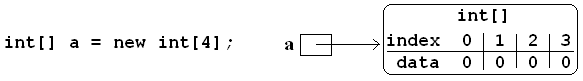
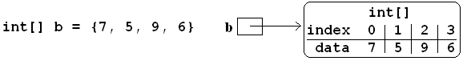
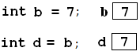
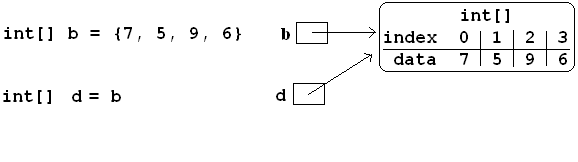

.. index:: 
   single: arrays; one dimensional

.. _one-dim-arrays:

One Dimensional Arrays
============================ 

Basic Syntax
---------------

A string is an immutable sequence of characters.  Arrays provide more general sequences, 
with the same indexing notation, but with free choice of the type of the items in the
sequence, and the ability to change the elements in the sequence.

For example, if we want the type for an array with ``int`` elements, it is ``int[]``.
In general for any element type, the type for an array of the element type is

    **type**\ ``[]``

so ::

   int[] a;

declares ``a`` to refer to an array containing ``int`` elements.  You do *not*
know how many elements will be allowed in this array from this declaration.  
We must give further information to create the corresponding array object.  
All object can be created using the ``new`` syntax.  An array must get a definite
length, which can be a literal integer of any integer expression.  For example ::

   int[] a;
   a = new int[4];
   
or combined with the declaration, ::

   int[] a = new int[4];

creates an array that holds 4 integers.  The elements of the array must get initial values.
Numerical arrays get initialized to all 0's with this syntax.

For a variety of reasons, including bookkeeping by the compiler, the actual data for
an array is *not* stored directly in the memory location allocated by the declaration.
The array could have any number of items, and hence the memory requirements are not known
at compile time.  Like all other object (as opposed to primitive) types,
what is actually stored at the memory location declared for ``a`` is a *reference* to the
actual place where the data for the array is stored.  
In actual compiler implementation this reference is an address in memory.
In diagrams we will illustrate object references with an arrow *pointing* to the actual 
location for the object's data.  For example after ``a`` is initialized:

The small box beside ``a`` is meant to indicate the memory space allocated when ``a`` is
declared.  As you can see that space does not actually contain the array, but only a 
*reference* to the array, pointing to the actual sequence of data for the array.
To make it easy to refer to the elements in the diagram, we also label the indices 
associated with each element, though they are not actual a part of what is stored in memory.

The general syntax to create a new array is

   ``new`` **type**\ ``[`` *length* ``]``
   
After the type, there are square brackets enclosing an expression for the length
of the array - this length is unchangeable after creation.

The elements inside an array can to referenced with the same index notation used
earlier for strings. :: 

    a[2]
    
refers to the element at index 2 (third element because of 0 based indexing).

Unlike with strings, this element can not only be read, but also be assigned to::

    a[0] = 7;
    a[1] = 5;
    a[2] = 9;
    a[3] = 6;

These four assignment statements 
would replace the original 0 values for each element in the array.

This is a verbose way to specify all array values. An array with the
same final data could be created with the single declaration::

   int[] b = {7, 5, 9, 6};

The list in braces ONLY is allowed as an initialization of a variable
in a declaration, not in a later assignment statement.  
Technically it is an initializer, not an array literal.

Individual array elements can *both* be used in expressions, and be assigned to. 
Continuing with the
earlier example code::

    a[2] = 4*a[1] - a[3];

``a[2]`` now equals 4\*5 - 6 = 14.

Arrays, like strings, have a ``Length`` property::

    Console.WriteLine(b.Length); // prints 4

Just as we saw that using a variable for an index was useful with
strings, array elements are almost always referred to with an index
variable in practice.  A very common pattern is to deal with each element in sequence,
and the syntax is the same as for a string.  Print all elements of array ``b``::

    for (int i= 0; i < b.Length, i++) { 
       Console.WriteLine(b[i]); 
    }
    
You could also use ``while`` syntax.  The ``foreach`` syntax would be::

   foreach( int x : b) {
      Console.WriteLine(x);
   }

The int type for ``x`` matches the element type of the array ``b``.

The shorter ``foreach`` syntax is not as general as the ``for`` syntax.  
For example, to print only the first *3* elements of b::

   for(int i= 0; i < 3; i++) {
      Console.WriteLine(b[i]);
   }

but the ``foreach`` syntax would not work, since it must process *all* elements.

Also use the ``for`` syntax to assign new values to the array elements, 
rather than just use the values in expressions::

   for(int i= 0; i < b.Length; i++) {
      b[i] = 5*i;
   }
   
Now the array ``b`` of our earlier examples (of length 4) would contain 0, 5,
10, and 15.

.. index::
   double:  command line; parameters
   double:  Main; parameters

.. _command-line-param:

Parameters to Main
---------------------

The Main function may take an array of strings as parameter, as in example 
:file:`PrintParam.cs`:

.. literalinclude:: ../examples/PrintParam.cs
   :start-after: chunk
   :end-before: chunk

By convention, the formal parameter for ``Main`` is called ``args``, 
short for arguments.  

Compile and run the program from the command line.
Run it again with some things at the end of the line like::

     mono PrintParam.exe hi there 123

This should print for you::

    There are 3 command line parameters.
    hi
    there
    123

See what quoted strings do.  Run the command::

     mono PrintParam.exe "hi there" 123

This should print for you::

    There are 2 command line parameters.
    hi there
    123
    
The quotes are important in many places.  For instance the **message** in the 
``hg commit -m message`` command must be one parameter.  
That generally requires quotes, unless you are given to one-word descriptions.

.. index::
   double: string; Split
   
.. _Split:

String Method Split
---------------------

A string method producing an array:

``string[] Split(char`` **separator** ``)``   
    Returns an array of substrings from *this* string.  They are the pieces left
    after chopping out the separator character from the string.  Example:: 
    
		csharp> var fruitString = "apple pear banana";
		csharp> string[] fruit = fruitString.Split(' ');
		csharp> fruit;
		{ "apple", "pear", "banana" }
		csharp> fruit[1];
		"pear"
		
Split is useful for parsing a line with several parts::

    string line = InputLine("Enter integers on a line");
    string[] tokens = line.Split(' ');
    int[] nums = new int[tokens.Length];
    for (int i = 0; i < nums.Length; i++) {
       nums[i] = int.Parse(tokens[i]);
    }

Here if the user enters "2 5 22", then ``tokens`` is an array containing strings "2", "5",
and "22".  If we want them all converted to integers and place in a new array,
we need to create an array of the same length, and loop through, parsing each
string in ``tokens`` into an integer in the corresponding location in ``nums``.

.. index:: alias

.. _alias:

References and Aliases
-------------------------

Object variables like arrays being references has important implications for
assignment.

With a primitive type like an ``int``, an assignment copies the data:

In the diagram, the contents of the memory box labeled ``a`` is copied to the
memory box labeled ``d``. The value of ``d`` starts off equal to the value of ``a``, 
but can later be changed independently.

Contrast an assignment with arrays.  The value that is copied is the *reference*,
not the array data itself, so both end up pointing at the *same*  actual array:

Hereafter, array assignments like::

   a[2] = -10;
   d[1] = 55;
   
would both change the *same* array.  Now ``a`` and ``d`` are essentially
names for the same thing (the actual array).  The technical term matches English:
The names are *aliases*.

This may seem like a pretty silly discussion.   Why bother to give two different 
names to the same object?  Isn't one enough?  In fact it is very important
in function/method calls.  An array reference can be passed as an actual value, 
and it is the array *reference* that is copied to the formal parameter, so
the formal parameter name is an **alias** for the actual parameter name.

.. note::
   If an array passed as a parameter to a method has elements changed in the
   method, then the change affects the actual parameter array.
   The change *remains* in the actual parameter array *after* the method has terminated.

.. index::
   double: example; Scale
   double: Scale; array parameter

For example, consider the following function::

   /** Modify a by multiplying all elements by multiplier. */
   static void Scale(int[] a, int multiplier)
   {
      for (int i = 0; i < a.Length; i++) {
         a[i] *= multiplier;  // or:  a[i] = a[i] * multiplier
      }
   }
   
The fragment::

   int[] nums = {2, 4, 1};
   Scale(nums, 5);
   
would *change* nums, so it ends up containing elements 10, 20, and 5.

.. index::
   single: array; anonymous initialization

.. _Anonymous-Array-initialization:

Anonymous Array Initialization
--------------------------------

Sometimes you want to use an array with specific values only
as a parameter to a function.  You could write something like ::

    int[] temp = {3, 1, 7};
    SomeFunc(temp);

but if ``temp`` is never going to be referenced again, you can 
do this without using a name::

    SomeFunc(new int[] {3, 1, 7});

It is essential to include the ``new int[]``, not just the ``{3, 1, 7}``.

Such an approach could also be used if you want to return a fixed
length array, where you have values for each parts, as in::

    return new int[] {minVal, maxVal};
    
    
.. index::
   double: example; command line adder
   double: Main; parameters

.. _command-line-adder-exercise:
   
Command Line Adder Exercise
~~~~~~~~~~~~~~~~~~~~~~~~~~~~~~

Write a program ``Adder.cs`` that calculates and prints the sum of 
command line parameters, so ::

    mono Adder.exe 2 5 22
    
would print 29.

.. index::
   double: example; TrimAll
   double: array; TrimAll

.. _trim-all-exercise:
   
Trim All Exercise
~~~~~~~~~~~~~~~~~~~~~~~~~~~~~~

Write a program ``Trimmer.cs`` that includes and tests a 
function with heading::

   /** Trim all elements of s and replace them in the array.
       Example: If a contains {" is  ", " it", "trimmed?   "}
       then after the function call the array contains
       {"is", "it", "trimmed?"}.   */
   static void TrimAll(string[] a) 
   
   
.. index::
   double: example; Dups
   double: array; Dups

.. _Dups-exercise:
   
Count Duplicates Exercise
~~~~~~~~~~~~~~~~~~~~~~~~~~~~~~

Write a program ``CountDups.cs`` that includes and tests a 
function with heading::

	/** Return the number of duplicate pairs in an array a.  
	 * Example: for elements 2, 5, 1, 5, 2, 5 
	 * the return value would be 4 (one pair of 2's three pairs of 5's. */
	public static int dups(int[] a)

.. index::
   double: example; Mirror
   double: array; Mirror

.. _Mirror-exercise:
   
Mirror Array Exercise
~~~~~~~~~~~~~~~~~~~~~~~~~~~~~~

Write a program ``MakeMirror.cs`` that includes and tests a 
function with heading::

	/** Create a new array with the elements of a in th opposite order.
	 * {"aA", "bB", "cC"} produces a new array {"cC", "bB", "aA"}
	 */
	public static string[] Mirror(string[] a)

.. index::
   double: example; Reverse
   double: array; Reverse

.. _Reverse-exercise:
   
Reverse Array Exercise
~~~~~~~~~~~~~~~~~~~~~~~~~~~~~~

Write a program ``ReverseArray.cs`` that includes and tests a 
function with heading::

	/** Reverse the order of array elements.
	 * {"aA", "bB", "cC"} -> {"cC", "bB", "aA"}
	 */
	public static void Reverse(string[] a)

   
.. index::
   double: example; Histogram
   double: array; Histogram

.. _Histogram-exercise:
   
Histogram Exercise
~~~~~~~~~~~~~~~~~~~~~~~~~~~~~~

Write a program ``MakeHistogram.cs`` that includes and tests a 
function with heading::

	/** Return a histogram array counting repetitions of values
	 *  start through end in array a.  The count for value start+i
	 *  is in index i of the returned array.  For example:
	 *  Histogram(new int[]{2, 0, 3, 5, 3, 5}, 0, 5) returns
	 *  a new array containing {1, 0, 1, 2, 0, 2}.  */
	public static int[] Histogram(int[] a, int start, int end)

   

..  later
    example `arraysFor <../examples/arraysForfiles.zip>`_, finish in class
    In loops example, Notebook class, add print notes backwards,
     interactive input loop, sentinels
     Finish `Scanner <JDK15Library.html#Scanner>`_ in the 1.5 lib web page
     Fill out stubs in the example utility class
    `UI <../examples/UIfiles.zip>`_.
     `Assignment 3 <../hw/hw3.html>`_
     loops project examples
     sumToN
     bitsNeeded
     See JDK library: String format method
     final loops project example
     loan table
     work in class stub of example
    `loopsArrays <../examples/loopsArraysfiles.zip>`_
     Loops are the hardest topic for many people. For more practice, there
    are many options:
    
    -  My extra loop and array exercises, with solutions, in the examples
       `arrayLoopProblems.html <../examples/arrayLoopProblems.html>`_,
       `arrayLoopSolutions.txt <../examples/arrayLoopSolutions.txt>`_,
       moreLoopArrayProblems
       (`.doc <../examples/moreLoopArrayProblems.doc>`_ or
       `.pdf <../examples/moreLoopArrayProblems.pdf>`_) with solutions
    -  Independent reviews of looping in
       `Codingbat.com <http://codingbat.com>`_: `While and for
       loops <http://javabat.com/doc/loop.html>`_ `Arrays and
       loops <http://javabat.com/doc/array.html>`_, plus extensive
       interactive problem sections of graded difficulty: String2, Array1,
       Array2, String3, and the extra challenging Array3
    
