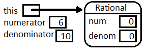
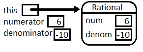
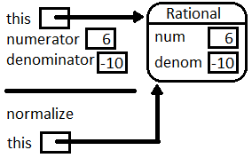
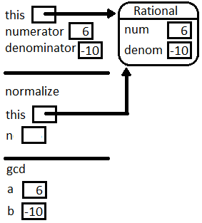
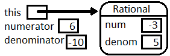
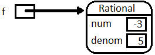
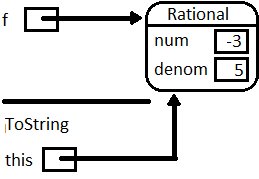
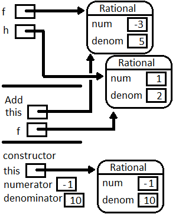
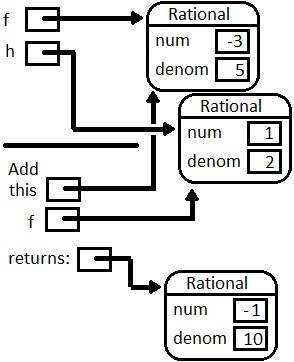
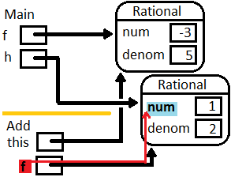

.. index::  class; Rational
   Rational class 
   
.. _rational:

The Rational Class
============================================

Like other numbers, we think of a rational number as a unit, 
but all rational numbers can be most easily represented as a fraction, 
a ratio of two integers. We can create a class Rational, so  ::

   Rational r = new Rational(2, 3);

would create a new Rational number for the mathematical expression, 2/3.

Our previous simple class examples have mostly been ways of 
collecting related data, with limited methods beyond getters and setters.
Rational numbers also have lots of obvious operations defined on them.  
Our Rational example we will use most of the concepts for object so far, 
and add a few more, to provide a rich practical class 
with a variety of methods. 

Thinking ahead to what we would like for our rational numbers, here is
some testing code.  Hopefully the method names are clear and reasonable. 
in the illustration
we operate on a single rational number, and do calculation with a pair,
and parse string literals.  The code is from 
:repsrc:`test_rational/test_rational.cs`:

.. literalinclude:: ../source/examples/test_rational/test_rational.cs

One non-obvious method is ``CompareTo``.  This one method allows
all the usual comparison operators to be used with the result.  
We will discuss it more in :ref:`rationals-revisited`.

The results we would like when running this testing code:

..  code-block:: none

	6/(-10) simplifies to -3/5
	reciprocal of -3/5 is -5/3
	-3/5 negated is 3/5
	-3/5 + 1/2 is -1/10
	-3/5 - 1/2 is -11/10
	-3/5 * 1/2 is -3/10
	(-3/5) / (1/2) is -6/5
	1/2 > -3/5 ? true
	-3/5 as a double is -0.6
	1/2 as a decimal is 0.5
	Parse "-12/30" to Rational: -2/5
	Parse "123" to Rational: 123
	Parse "1.125" to Rational: 9/8

A Rational has a numerator and a denominator.  We must remember that data. 
Each individual Rational that we use will have its own numerator and 
denominator, which we store as the instance variables
(and which we abbreviate since we are lazy)::

    public class Rational
    {
       private int num;
       private int denom;       
       // ... 

We could have a very simple constructor that just copies in values for 
the numerator and denominator.  However, there is an extra wrinkle with
rational numbers:  They can be represented many ways.  You remember from
grade school being told to "reduce to lowest terms".  This will keep
our internal representations unique, and use the smallest numbers.  

Intermediate operations and initial constructor parameters
will not always be in lowest terms.  To reduce to lowest terms
we need to divide the original numerator and denominator by their 
:ref:`gcd`.    We include a *static* GCD method taken from that section,
and make the adjustment to lowest terms in a helping method, ``Normalize``,
that is called by the constructor:

.. index::  private; helping method

.. literalinclude:: ../source/examples/rational_nunit/rational.cs
   :start-after: normalize chunk
   :end-before: chunk

There are several things to note about this method:  

*  It is *private*.
   It is only used as a helping method, called from inside of Rational.  It
   is not a part of the public interface used from other classes.  
*  We need to deal with a 0 denominator somehow.  We should be causing an 
   *exception*, but that is an advanced topic, so we wimp out and just
   change the denominator to 1.
*  There is one other technical issue in getting a unique representation:  The
   denominator could start off being negative.  
   If that is the case, we change the sign of 
   both the numerator and denominator, so we always end up with a positive
   denominator.  We will use this fact in several places.
*  It calls a static method of the class, ``GCD``.  Classes can have both
   instance and static methods.  It is fine for an instance method like
   ``Normalize`` to call a static method:  The instance variables cannot be
   accessed.  Here ``GCD`` is passed all its data explicitly through 
   its parameters.

The complete constructor, using ``Normalize``, is below.  
Note that by the time we
are done constructing a new Rational, it is in this normalized form:  lowest
terms and positive denominator:

.. literalinclude:: ../source/examples/rational_nunit/rational.cs
   :start-after: constructor chunk
   :end-before: chunk

The call to the ``Normalize`` method is another place where we have a
call without dot notation, since it
is acting on the same object as for the constructor.

We mentioned that instance method ``Normalize`` calls static method ``GCD``,
and this is fine.  The reverse is not true:

.. warning::
   Inside a ``static`` method there
   is *no* current object.  A common compiler error is caused when you
   try to have a static method call
   an instance method without dot notation for a specific object.  
   The shorthand notation
   without an explicit object reference and dot cannot be used, because 
   there is no
   current object to reference implicitly::
   
	   public void AnInstanceMethod() 
	   {
		 ...
	   }
	   
	   public static void AStaticMethod()  // no current object
	   {
		  AnInstanceMethod();  // COMPILER ERROR CAUSED
	   }
	
   On the other hand, there is no issue when
   an instance method calls a static method.  (The instance variables are just 
   inaccessible inside the static method.)
   
 
The Rational class has the usual getter methods, to access the
obvious parts of its state:

.. literalinclude:: ../source/examples/rational_nunit/rational.cs
   :start-after: getter chunk
   :end-before: chunk
 
We certainly want to be able to display a Rational as a string version:

.. literalinclude:: ../source/examples/rational_nunit/rational.cs
   :start-after: ToString chunk
   :end-before: chunk

Note that we simplify so you would see "3" rather than "3/1".  This is also
a place where the normalization to have a positive denominator comes in:
a negative Rational will always have a leading "-" as in "-5/9" rather than
"5/-9"

With a Rational, several other conversions make sense:  to ``double``
and ``decimal`` approximations.

.. literalinclude:: ../source/examples/rational_nunit/rational.cs
   :start-after: ToDouble chunk
   :end-before: chunk

So far we have returned built-in types.  What if we wanted to generate
the reciprocal of a Rational?  That would be another Rational.  It is
legal to return the type of the class that you are defining!
How do we make a new Rational? 
We have a constructor!  We can easily use it.  The reciprocal
swaps the numerator and denominator.  It is also easy to negate
a Rational:

.. literalinclude:: ../source/examples/rational_nunit/rational.cs
   :start-after: Reciprocal chunk
   :end-before: chunk

Static methods are still useful.  
For example, in analogy with the other numeric types 
we may want a static ``Parse`` method
to act on a string parameter and return a new Rational.

The most obvious kind of string to parse would be one like ``"2/3"`` or ``"-10/77"``, 
which we can split at the ``'/'``.  
Integers are also rational numbers, so we would like to parse ``"123"``.
Finally decimal strings can be converted to rational numbers, 
so we would like to parse ``"123.45"``.

See how our ``Parse`` method below distinguishes and handles
all the cases.  It constructs integer strings,
``parts[0]`` and ``parts[1]``, for both the numerator and denominator,
and then parses the integers.  Note that the method *is* ``static``.  
There is no Rational
being referred to when it starts, but in this case the method *returns* one.

That last case is the trickiest.  For example ``"123.45"`` becomes 12345/100 
(before being reduced to lowest terms).  
Note that there were originally *two* digits after the decimal point 
and then the denominator gets *two* zeroes to have the right power of 10:

.. literalinclude:: ../source/examples/rational_nunit/rational.cs
   :start-after: Parse chunk
   :end-before: chunk

Method Parameters of the Same Type
-------------------------------------

We can deal with the current object without using dot notation.  What if we are
dealing with *more than one* Rational, the current one *and* another one, 
like the parameter in Multiply:

.. literalinclude:: ../source/examples/rational_nunit/rational.cs
   :start-after: Multiply chunk
   :end-before: chunk

We can mix the shorthand notation for the current object's fields 
and dot notation for another
*named* object:  ``num`` and ``denom`` refer to the fields in the *current* object, and
``f.num`` and ``f.denom`` refer to fields for the other 
``Rational``, the parameter ``f``.

.. literalinclude:: ../source/examples/rational_nunit/rational.cs
   :start-after: Multiply chunk
   :end-before: Divide chunk

We do not refer to the fields of ``f`` through the public methods 
``GetNumerator`` and ``GetDenominator``.  
Though ``f`` is not the same *object*, it is the same *type*: 

.. note::
   Private members of *another* object of the *same* type are 
   accessible from method definitions in the class.  
   
There are a number of other arithmetic methods in the source code for Rational
that return a new Rational result of the arithmetic operation.  They *do* review 
your knowledge of arithmetic! They do *not* add further C# syntax.

The whole code for Rational is in :repsrc:`rational_nunit/rational.cs`.
The testing code we started with, in
:repsrc:`test_rational/test_rational.cs`
uses all the methods.  We will see more advance ways to test Rational
in :ref:`testing`.

There is also a more convenient version of Rational, 
using advanced concepts, in :ref:`defining_operators`.

Pictorial Playing Computer
---------------------------

Let us start pictorially playing computer on :file:`test_rational.cs`, 
as a review of much of the previous sections.  We explicitly show a local variable
``this`` to identify the current object in an instance method or constructor.  

The first line of ``Main``, ::

   Rational f = new Rational(6, -10);
   
creates a new Rational, so it calls the constructor.  At the very beginning of the
constructor, a prototype ``Rational`` is already created as the current object,
so immediately, there is a ``this``.  
The parameters 6, and -10 are passed, initializing the explicit local
variables ``numerator`` and ``denominator``.  
The figure illustrates the memory state at the beginning of the constructor call:

Note the immediate value assigned to the numeric instance variables is zero:  This is 
as discussed in :ref:`default-fields`.  
Of course we do not want to keep those default values:
The constructor finds the value of the local variable ``numerator``, and needs to 
assign the value 6 to a variable ``num``.  The compiler has looked 
first for a local variable ``num``, and found none. 
Then it looked *second* for an instance variable in the object pointed to
by ``this``.  It found ``num`` there.  Now it copies the 6 into that location.  
Similarly for ``denominator`` and ``denom``:

Then the constructor calls ``Normalize``.  
Since ``Normalize`` is also an instance method,
a reference to ``this`` is passed implicitly.  
While illustrating the memory state for more than one active method, 
we separate each one with a horizontal segment.

Later ``Normalize`` calls ``GCD``.  Since ``GCD`` is static, note that the local 
variables for ``GCD`` do *not* contain a reference to ``this``.

At the end of ``GCD`` the ``int`` 2 is returned and initializes 
``n`` in the calling method ``Normalize``.
Then ``Normalize`` modifies the instance variable pointed to by ``this``, 
and finishes.

.. image:: images/finishNormalize.png
   :width: 124 pt

That is the same object ``this`` in the constructor.  
Just before the constructor completes we have:

Then in ``Main`` the constructor's ``this`` is the reference to the new object 
initializing ``f``.

Consider the next line of ``Main``::

   Console.WriteLine("6/(-10) simplifies to {0}", f);
          
We omit the internals of the WriteLine call, except to note that it must convert
the reference ``f`` to a string.  As with any object,
it does this by calling the ``ToString`` method for ``f``,
so the implicit ``this`` in the call to ``ToString`` refers to the same object as ``f``:

``ToString`` returns "-3/5", and it gets printed as part of the line generated
by ``WriteLine``....  

We skip the similar details through two more ``WriteLine`` statements and the 
initialization of ``h``::

    Rational h = new Rational(1,2);

The ``WriteLine``
statement after that needs to evaluate ``f.Add(h)``, generating a call to ``Add``.
The next figure shows the two local variables in ``Main``, ``f`` and ``h``, each
pointing to a ``Rational`` object.  The image shows the situation 
in the call to ``Add``, just before the end of the return statement,
when the new Rational is being constructed.
 
In the local variables for the method ``Add`` 
see what the implicit ``this`` refers to, and what the 
(local to ``Add``) variable ``f`` refer to.  As the figure shows, 
this use of a local variable
``f`` is independent of the ``f`` in ``Main``:

Since the return statement in ``Add`` creates a new object, 
the figure shows  a call to the
constructor from inside ``Add``.  We do not go through the details of another
constructor call, but
``this`` in the constructor points to the Rational shown and returned by
``Add``:

which gets sent to the ``WriteLine`` statement 
and gets printed in ``Main`` as in the earlier code.

Make sure you see how the pictures reinforce these important ideas:

*  Keeping track of the ``this`` with 
   constructors and instance methods (but not static methods).
*  The aliasing of ``Rational`` objects used as parameters explicitly or 
   implicitly (``this``).
   
We have played computer before in procedural programming, 
following individually explicitly named
variables.  This has allowed us to follow loops clearly after the code is
written.  The pictorial version with multiple object references and method calls
is also useful for checking on code that is written with many object
references.  

When first *writing* code with object references that you are manipulating, 
a picture of the setup
showing the references in your data is also helpful.  
New object-oriented programmers often have a hard time referring to the
data they want to work with. 
If you have a picture of the data relationships
you can point with a finger to a part that you want to use.
For example 
in the call to ``Add``, one piece of data you need for your arithmetic is
the ``num`` field in ``f``.  Then you must be carful to note
that *only local variables can be referenced directly*
(including the implicit ``this``).   If you want to refer to data that is not a local
variable, you must follow the reference path arrow that leads *from a local variable* to
an instance field that you want to reference. 

Then use the proper object-oriented notation to refer to the path.  
In the example, it takes one step,
from local variable ``f`` to its field ``num``, referred to as ``f.num``.
Similarly the current object's ``num`` is connected through ``this``, but C# shorthand
allows ``this.`` to be omitted.  And so on, for ``f.denom`` and ``denom``.

Visually following such paths will be even more important later, when we construct
more complex types of objects, and you need to follow
a path through *several* references in sequence.

.. index:: exercise; ForceMatch

ForceMatch Exercise
----------------------

Suppose we have a class::

   class Pair
   {
      private int x,y;
      
      public Pair(int x, int y)
      {
          this.x = x; this.y = y;
      }
      
      ///Mutate the parameter so its instance variables match this object
      public void ForceMatch(Pair p)
      {
         // need code ...
      }
      
      public override string ToString()
      {
         return string.Format("({0}, {1})", x, y);
      }
   }
    
A test would be code in another class::

    Pair first = new Pair(3, 7);
    Pair second = new Pair(1, 9)
    Console.WriteLine(second);  // prints (1, 9)
    first.ForceMatch(second);
    Console.WriteLine(second);  // prints (3, 7)
    
a.  Would this code work?  If not, explain why not::

      public void ForceMatch(Pair p)
      {
         p = new Pair(x, y);
      }
      
    If you do not see it, 
    do a graphical play-computer like in the last section.

b.  Complete the body of ``ForceMatch`` correctly.    
      