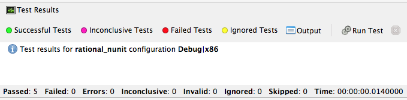
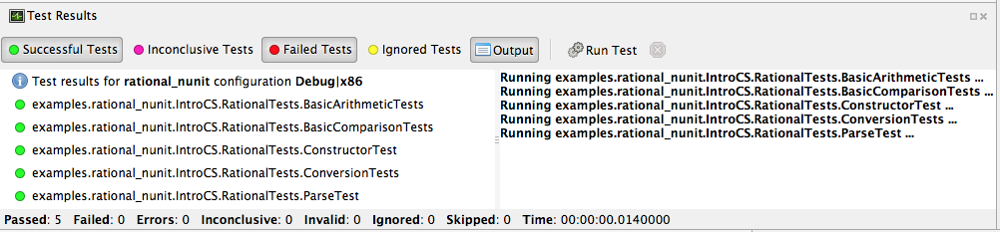
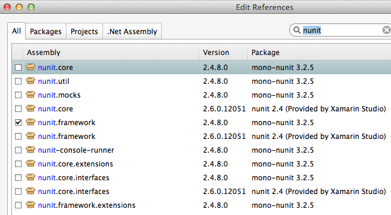
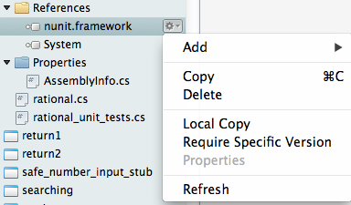

.. index:: testing

.. _testing:

Testing
============

Now that we have learned a bit about classes, we're going to use the same feature
to support *unit testing*. Unit testing is a concept that will become part of just
about everything you do in future programming-focused courses, so we want to make sure
that you understand the idea and begin to make use of it in all of your work.

The notion of unit testing is straightforward in principle. When you write a program
in general, the program comprises what are properly known as units of development. 
Each language has its own definition of what units are but most modern programming
languages view the *class* concept as the core unit of testing. Once we have a class,
we can test it and all of the parts associated with it, especially its methods.

We will be introducing parts of file :repsrc:`rational_nunit/rational_unit_tests.cs`.

.. index:: testing; assertion 
   assertion testing

Assertions
-------------

A key notion of testing is the ability to make a logical assertion about something
that generally must hold *true* if the test is to pass. 

Assertions are not a standard language feature in C#. Instead, there are a number of
classes that provide functions for assertion handling. In the framework we are using for
unit testing (NUnit), a class named Assert supports assertion testing.

In our tests, we make use of an assertion method, ``Assert.IsTrue()`` to determine
whether an assertion is successful. If the variable or expression passed to this
method is *false*, the assertion fails.

Here are some examples of assertions:

- ``Assert.IsTrue(true)``: The assertion is trivially successful, 
  because the boolean value ``true`` is true.
  
- ``Assert.IsTrue(false)``: The assertion is not successful, because the boolean value
  ``false`` is not true!
  
- ``Assert.IsFalse(false)``: This assertion is successful, because 
  ``false`` is, of course, false.
  
- ``Assert.IsTrue(5 > 0)``: Success

- ``Assert.IsTrue(0 > 5)``: Failure

There are many available assertion methods. In our tests, we use ``Assert.IsTrue()``,
which works for everything we want to test. Other assertion methods do their magic
rather similarly, because every assertion method ultimately must determine whether
what is being tested is true or false. 

.. index:: attribute [ ]
   single: [ ]; attribute
   
Attributes
-------------

Besides assertions, a building block of testing (in C# and beyond) comes in the form
of attributes. Attributes are an additional piece of information that can be attached 
to classes, variables, and methods in C#. There are two attributes of interest to us:

- [TestFixture]: This indicates that a class is being used for testing purposes. 

- [Test]: This indicates that a method is one of the methods in a class being used
  for testing purposes.
  
Without these annotations, classes and methods will *not* be used for testing purposes.
This allows a class to have some methods that are used for testing while other methods
are ignored.

In the remainder of this section, we're going to take a look at the strategy for testing
the Rational class. In general, your goal is to ensure that the entire class is tested.
It is easier said than done. In later courses (Software Engineering) you would learn about
strategies for *coverage* testing. 

Our strategy will be as follows:

- Test the constructor and make sure the *representation* of the rational number is
  sound. If the constructor isn't initializing an instance properly, it is likely
  that little else in the class will work properly.

- Then test the rest of the class. Whenever possible, group the tests in some logical
  way. In the case of the Rational class, there are three general categories (and one
  rather special one): arithmetic operations, comparisons, and conversions. In addition,
  there is the parsing test, which ensures that we can convert strings representing
  fractions into properly initialized (and reduced) rational numbers.

Let's get started.

Testing the Constructor
--------------------------

.. literalinclude:: ../source/examples/rational_nunit/rational_unit_tests.cs
   :start-after: snip-ConstructorTest-begin
   :end-before: snip-ConstructorTest-end
   :linenos:

Testing the constructor is fairly straightforward. We essentially test three basic 
cases:

- Test whether a basic rational number can be constructed. In the above, we test for
  3/5, 3/-5, 6/10, and 125. Per the implementation of the Rational class (how we defined
  it), these should result in fractions with numerators of 3, -3, 3, and 12; and denominators
  of 5, 5, 5, and 1, respectively.

- As you can observe from the code, we perform basic assertion testing to ensure that 
  the numerators and denominators are what we expect. For example::

     Assert.IsTrue(r.GetNumerator() == 3)

  Tests whether the newly minted rational number, Rational(3, 5), actually has the 
  expected numerator of 3.

- If we are able to get through the entire code of the ``ConstructorTest()`` method,
  our constructor test is a success. Otherwise, it is a failure.

We'll look at how to actually run our tests in a bit but let's continue taking a look
at how the rest of our testing is done. 

Testing Rational Comparisons
----------------------------------

.. literalinclude:: ../source/examples/rational_nunit/rational_unit_tests.cs
   :start-after: snip-BasicComparisonTests-begin
   :end-before: snip-BasicComparisonTests-end
   :linenos:

It is pretty well established by now that the ability to compare is of fundamental importance
whenever we are talking about data. Everything we do, especially when it comes to searching
(finding a value) and sorting (putting values in order) depends on comparison.

In this test, we construct a few Rational instances (r1, r2, and r3) and perform at least
one test for each of the essential operators (>, <, and =). Recall from our earlier discussion
of the Rational class that the CompareTo method return a value ``< 0`` 
when one Rational is *less than* another. It returns a number 
``> 0`` for *greater than*, and ``== 0`` for *equal to*.

If any one of these comparisons fails, this means that we cannot rely on the ability to 
compare Rational numbers. This will likely prevent other tests from working, such as the
arithmetic tests, which rely on the ability to test whether a *computed result* matches
an *expected result* (e.g. 1/4 + 2/4 == 3/4).

Testing Rational Arithmetic
-------------------------------

.. literalinclude:: ../source/examples/rational_nunit/rational_unit_tests.cs
   :start-after: snip-BasicArithmeticTest-begin 
   :end-before: snip-BasicArithmeticTest-end
   :linenos:

Testing of arithmetic is a fairly straightforward idea. For all of these tests, we 
create a couple of rational numbers (47/64 and -11/64) and then call the various methods
to perform addition, subtraction, multiplication, division, reciprocal, and negation.

The key to testing arithmetic successfully in the case of a Rational number is to know
know what the result *should be*. As a concrete example, the result of adding these
two rational numbers should be 36/64. So the testing strategy is to use the ``Add()`` 
method to add the two rational numbers and then test whether the result of the addition
is equal to the *known* answer of 36/64.

As you can observe by looking at the code, the magic occurs by checking whether the 
*computed* result matches the *constructed* result::

    Assert.IsTrue(r.CompareTo(new Rational(36, 64)) == 0);

Because we have *separately* tested the constructor and comparison methods, we can
assume that it is ok to rely upon comparison methods as part of this arithmetic test.

And it is in this example where we begin to see the *art of testing*. You can write 
tests that assume that other tests of features you are using have *already passed*. In the
event that your assumption is wrong, you'd be able to know that this is the case, because
all of the tests you assumed to pass would not have passed.

Again, to be clear, the arithmetic tests we have done here *assume* that we can rely on
the constructor and the comparison operation to determine equality of two rational numbers.
It is entirely possible that this is not true, so we'll be able to determine this when
examining the test output (we'd see that not only the arithmetic test fails but possibly the
constructor and/or comparison tests as well).

The remaining tests are fairly straightforward. We'll more or less present them as is with
minimal explanation as they are in many ways variations on the theme.

Testing Rational Conversions (to other types)
-------------------------------------------------

.. literalinclude:: ../source/examples/rational_nunit/rational_unit_tests.cs
   :start-after: snip-BasicConversionTests-begin
   :end-before: snip-BasicConversionTests-end
   :linenos:

In this test, we want to make sure that Rational objects can be converted to floating point
and decimal types (the built-in types of the C# language).

For example, Rational(3/6) is 1/2, which is 0.5 (both in its floating-point and decimal
representations.

Testing the Parsing Feature
-----------------------------------

.. literalinclude:: ../source/examples/rational_nunit/rational_unit_tests.cs
   :start-after: snip-ParseTest-begin
   :end-before: snip-ParseTest-end
   :linenos:

The parsing test tests whether we can convert the string representation of a rational number
into an actual (reduced) rational number. We test three general cases:

- The ability to take a fraction and convert it into a rational number. This fraction may
  or may not have a "-" sign in it. For example -12/30 should be equivalent to constructing
  a Rational(-12, 30).

- The ability to take a whole number and get a proper Rational, e.g. 123 is equal to
  Rational(123)

- The ability to take a textual representation (1.125) and get a proper Rational(9, 8)
  representation. In this case, we are also getting an extra test to ensure the result
  is reduced.

.. index:: Xamarin Studio; running NUnit tests
   testing; running in Xamarin Studio
   
.. _running-nunit-tests:

Running the NUnit Tests
---------------------------

#. In Xamarin Studio, select the rational_nunit project. 
#. In the main Xamarin Studio menu click "Run" and select "Run Unit Tests" 

A test pad should appear and show something like

This likely just shows the overall results in the summary line at the bottom.
You can show details by clicking on one or more of headings at the 
top of the pad.  In particular, if you click Successful Test, Failed Tests, 
and Output (and likely drag the top of the pad to make 
it large enough to see everything), you should see something like

As you can see in the above displays, all of the tests in ``RationalTests``  
get executed, and they all pass.
There are no failed tests to see, 
but that part would be the most important details if any were there!
The output just details the sequence of execution.

Xamarin Studio remembers the headings selected, so next time you run tests,
the same details will show.

The testing file is using NUnit.Framework.  There is a little more to this.
If you edit the references, selecting All sources, and entering nunit
in the search box, you see 

Note there are more than one version of nunit.framework. On a Mac,
the selected version worked directly, but the logical looking one, provided 
by Xamarin, did *not* work directly.  Either worked if we select the context
menu in the Solutions pad for the nunit.framework version added to the references, 
and make it look like

   
with the "Require Specific Version" item toggled so it is *not* checked.

We waited until now to discuss unit testing, because the test classes are coded with
*instance* methods,
unlike the static methods that we started out with.

A test can also call ``Main`` of a program, with specified parameters that
would normally come from the command line.  See the small project 
:repsrc:`cmdline_to_file`.

.. index:: String Replace NUnit Exercise
   exercise; String Replace NUnit
   
String Replace NUnit Test Exercise
~~~~~~~~~~~~~~~~~~~~~~~~~~~~~~~~~~~~

If you completed the program from the stub 
:repsrc:`string_manip_stub/string_manip.cs`,
then add a testing class using NUnit that tests ``ReplaceFirst`` 
with the same parameters as used in the original file's ``Main``.  
If you did the elaboration of ``ReplaceFirst`` that just returns the original
string when the target is not found, then add tests for that, too.
Remember the necessary library reference and try it out.

.. index:: Grade File NUnit Exercise'
   exercise; Grade File NUnit test
   
Grade File NUnit Test Exercise
~~~~~~~~~~~~~~~~~~~~~~~~~~~~~~~~~~~~

Add a testing class using NUnit to :ref:`hw-gradefiles`.  
Remember the necessary library reference.
Sample data files and files for testing the results
are included in the project.  Just test 
using command line parameters (so there is no Console input).  
Test with both comp170 and comp150.  

