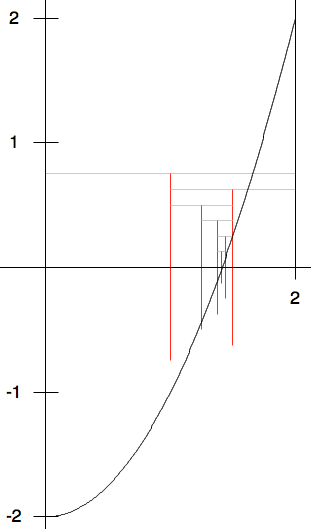

While Examples
==============

.. index:: bisection method

.. _bisection-method:

Bisection Method
~~~~~~~~~~~~~~~~~

For a very different example we look to scientific computing.  In math 
class you likely learned various ways to find roots of functions f(x) exactly.
In practice those methods almost never work beyond low order polynomials.
Hence the best we can do usually is to approximate solutions numerically.  
One broadly useful approach is the *bisection method*.  You just need a
continuous function (with an unbroken graph), 
and you need to first find two places, 
a and b, where f(a) and f(b) have opposite signs. If f is continuous and goes
between positive and negative values, then it must cross 0 somewhere in between,
and so there must be a real solution.  The question is how to get close
to a crossing point efficiently.

As an example we show :math:`f(x)=x^2 - 2`, in the range from x = 0 to x = 2.
As a first example we choose a simple function where the root can be figured symbolically,
in this case the square root of 2.  The figure below shows the graph, 
with extra horizontal and vertical lines that will will be explained.

In the figure a= 0, f(0) < 0, b = 2, f(2) > 0.  

The basic idea is to bisect the interval between a and b, finding the midpoint,
c = (a+b)/2. If f(c) is 0, you are done.  
Otherwise f(c) has a sign which must be opposite *one* of f(a) and f(b).  

In the figure the initial interval has the same x coordinates as for the top gray line.
Its midpoint is at 1, the x coordinate of the red vertical segment coming down from
the top gray line in the figure.  Note f(1) < 0, the opposite sign of f(2), 
so we next consider the half of the original interval from the midpoint 1 to 2,
with the next gray line marking this interval.
The function still must cross 0 in the smaller interval because of the opposite
signs for f on the endpoints.  In
the iterative procedure, you  continue this process, halving the length of 
the interval,
shifting one endpoint or the other to be the middle
of the most recent interval, so for each interval, the signs of f on 
the two ends are opposite.
Repeating this procedure, you can home in on as small an interval around a
crossing point (root) as you like.  
The figure show this process for the first 5 steps,
halving the interval length each time.  You need to look at the output of the code to
follow the results for even smaller intervals.

This approach always works, as long as the signs of f
at the initial endpoints are distinct.  Our ``Bisection`` functions check, 
and if this initial requirement
is violated, the function returns the special double code value,
``double.NaN``, meaning *not a number*.
 
There are other approaches to finding roots that may be faster when they work, 
but many of these methods can also have some chance of completely failing, 
so root finding algorithms generally have two
extra parameters:  a maximum number of iterations and a tolerance that
indicates how close to a root is close enough.

In the ``Bisection`` function we use ``a`` and ``b`` 
as the endpoints of an interval and ``c`` as the 
midpoint.  In each iteration the value of ``a`` or ``b`` is reset to be the
previous midpoint value ``c``.
Of course a production version would not print out all the intermediate data,
as the interval shrinks, but we do for illustration:

.. literalinclude:: ../../examples/introcs/bisection_method1/bisection_method1.cs
   :start-after: chunk
   :end-before: chunk
   :dedent: 6

Since the bisection method always homes in on a real root rapidly,
an alternate version specifically for the bisection method
finds the *best* approximation possible with ``double``
arithmetic.  While you can always halve an interval mathematically, you
eventually run out of distinct ``double`` values! We can stop when
the midpoint (calculated with limited ``double`` precision) 
is *exactly* the same as ``a`` or ``b``:

.. literalinclude:: ../../examples/introcs/bisection_method1/bisection_method1.cs
   :start-after: end chunk
   :end-before: end chunk
   :dedent: 6

C# remembers ``double`` values to more decimal places than it will actually 
display, so the second illustration also shows the difference between ``a`` and ``b``,
indicating the double values are still not really equal even after their
displays match.  

You can try this full example, 
:repsrc:`bisection_method1/bisection_method1.cs`.  
Note the special function checking for ``double.NaN`` in ``Main``, 
because ``double.NaN`` is not equal to itself!

The current versions have a major limitation:  They just work with the one
canned version of the function ``f`` in the class.  
You need to edit 
the source code to use the same process with a different function!  
There are several ways around this using more advanced C# features.
After the section :ref:`interface`, a more flexible version
should make sense, :repsrc:`bisection_method/bisection_method.cs`,
explored further in :ref:`bisection-exercise`.  The more
advanced version illustrates with the function in the initial version and
several others, all using the same bisection function.

.. index:: exercise; savings

.. _savings_exercise:

Savings Exercise
~~~~~~~~~~~~~~~~

The idea here is to see how many years it will take a bank account to grow
to at least a given value, assuming a fixed annual interest.
Write a program ``savings.cs``.
Prompts the user for three numbers: an initial balance, the annual percentage
for interest as a decimal. like .04 for 4%, and the final balance desired.
Print the initial balance, and the balance each year until
the desired amount is reached. Round displayed amounts
to two decimal places, as usual.

The math:  The amount next year is the amount now times
(1 + interest fraction),
so if I have $500 now and the interest rate is .04,
I have $500*(1.04) = $520 after one year, and after two years I have,
$520*(1.04) = $540.80.
If I enter into the program a $500 starting balance, .04 interest rate and
a target of $550, the program prints::

   500.00
   520.00
   540.80
   563.42
   
.. index:: exercise; strange sequence
  
.. _Strange-Seq-Ex:   

Strange Sequence Exercise
~~~~~~~~~~~~~~~~~~~~~~~~~

Save the example program :repsrc:`strange_seq_stub/strange_seq.cs` 
in a project of your own.

There are three functions to complete.  Do one at a time and test.

``Jump``: First complete the definitions of function ``Jump``.  
For any integer ``n``, ``Jump(n)`` is ``n/2`` if ``n`` is even, 
and ``3*n+1`` if ``n`` is odd.
In the ``Jump`` function definition use an |if-else|
statement.  Hint [#oddeven]_

``PrintStrangeSequence``: 
You can start with one number, say n = 3, and *keep* applying the
``Jump`` function to the *last* number given, 
and see how the numbers jump around!  ::

	Jump(3) = 3*3+1 = 10; Jump(10) = 10/2 = 5;
	Jump(5) = 3*5+1 = 16; Jump(16) = 16/2 = 8;
	Jump(8) = 8/2  =   4; Jump(4) =   4/2 = 2;
	Jump(2) = 2/2  =   1

This process of repeatedly applying the same function to the most recent result
is called function *iteration*.  In this case you see that iterating the
``Jump`` function, starting from n=3, eventually reaches the value 1.

It is an *open research question* whether iterating the Jump function
from an integer ``n`` will eventually reach 1,
for *every* starting integer ``n`` greater than 1.
Researchers have only found examples of ``n`` where it is true.
Still, no general argument has been made to apply to the
*infinite* number of possible starting integers.

In the PrintStrangeSequence you iterate the ``Jump`` function 
starting from parameter value ``n``, as long as the current number is not 1. 
If you start with 1, stop immediately.

``CountStrangeSequence``:  Iterate the ``Jump`` function as in 
``PrintStrangeSequence``.  Instead of printing each number in the sequence,
just count them, and return the count.

.. later - sequence of counts?
    After you have finished and saved ``jump_seq.cs`` copy it and save
	the file as ``jump_seq_lengths.cs``.

	First modify the main method so it prompts the user
	for a value of n, and then prints just the length of the iterative sequence
	from listJumps(n).  Hint [#]_

	Then elaborate the program so it prompts the user for two integers:
	a lowest starting value of n
	and a highest starting value of n.
	For all integers n in the range from the lowest start through
	the highest start, including the highest,
	print a sentence giving the starting value of n
	and the length of the list from ``listJumps(n)``.  An example run::

		Enter lowest start: 3
		Enter highest start: 6
		Starting from 3, Jump sequence length 8.
		Starting from 4, Jump sequence length 3.
		Starting from 5, Jump sequence length 6.
		Starting from 6, Jump sequence length 9.

.. index:: exercise; roundoff II
  
.. _roundoff2:   

Roundoff Exercise II
~~~~~~~~~~~~~~~~~~~~~~~~~

Write a program to complete and test the function with this heading
and documentation::

   /// Return the largest possible number y, so in C#: x+y = x
   /// If x is Infinity return Infinity. 
   /// If x is -Infinity, return double.MaxValue.
   /// Assume x is not NaN (which is equal to nothing).
   static double Epsilon(double x)	

Hint:  The non-exceptional case can have some similarity 
to the bisection in the best root approximation example:
start with two endpoints, ``a`` and ``b``, where ``x+a = x`` and 
``x+b > x``, and reduce the interval size by half....

.. [#oddeven]
   If you divide an even number by 2, what is the remainder?  Use this idea
   in your ``if`` condition.
